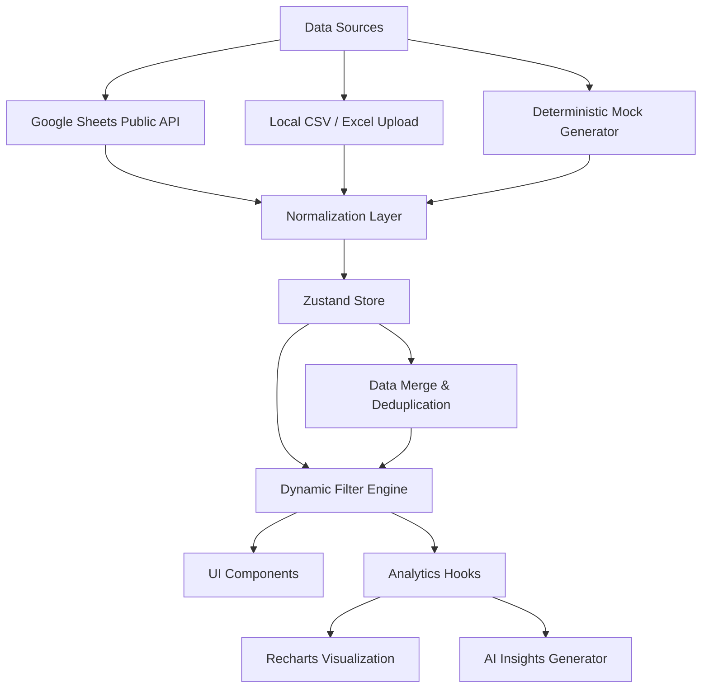

<div align="center">
  
  
  # Multi-Source Analytics Dashboard
  
  <p>A modern SaaS-style analytics platform integrating Google Sheets, CSV/Excel ingestion, real-time visualizations, and intelligent business insights.</p>

  **[🚀 Live Demo](https://multi-source-analytics-dashboard.vercel.app/)** | **[🎬 Video Walkthrough](https://drive.google.com/drive/folders/1zG0PmEg-_pmdwTss2CVpT1Eef4L7hzaF?usp=sharing)**

  [](https://react.dev/)
  [](https://vitejs.dev/)
  [](https://www.typescriptlang.org/)
  [](https://tailwindcss.com/)
  [](https://github.com/pmndrs/zustand)
</div>

---

## 🌟 Overview

DataPulse is a highly polished, interactive SaaS dashboard designed to unify fragmented data sources. Whether your data lives in Google Sheets, local CSV files, or Excel spreadsheets, DataPulse merges, deduplicates, and visualizes it instantly entirely in the browser. 

Designed with a premium UI, it features smooth transitions, comprehensive empty states, AI-driven business insights, and a professional light-theme design.

## Screenshots

### Dashboard


### Analytics


### Data Upload


### Settings


---

## ✨ Key Features

- 🔄 **Multi-Source Data Fusion**: Fetch live data from public Google Sheets (without API keys) and merge it with local CSV/Excel uploads.
- 🚦 **Intelligent Deduplication**: Automatically detects duplicate records across different data sources with an option to toggle ignoring or highlighting duplicates.
- 🤖 **AI Business Insights**: Dynamically generates modular insights (like highest performing categories or conversion drops) directly from active datasets.
- 📈 **Dynamic Charting**: Built with Recharts. Includes responsive Revenue trend lines, Category pie charts, and Region comparison bars.
- 🎨 **Premium Corporate Aesthetics**: Clean white background, black text, and soft light-purple accents for a professional-grade experience.
- ⚡ **High Performance**: Memoized analytics derivations, chunked rendering for tables, and Zustand state persistence.
- 📥 **Export Capabilities**: Export the entire dashboard, individual charts to PNG, or filtered table records to CSV in a single click.

---

## 🏗 Architecture



### 🧠 Optimization Decisions
- **Zustand over Redux/Context**: Minimal boilerplate, hook-based access, and zero-configuration persistence.
- **Client-side Parsing**: Utilizing `papaparse` and `xlsx` offloads computational burden from backend to the client.
- **Memoized Analytics**: Extensive use of `useMemo` in `useAnalytics.ts` ensures that sorting, filtering, and aggregation only recalculate when underlying source data changes, keeping charts buttery smooth.
- **Tailwind v4 Vite Plugin**: We adopted the newest Tailwind CSS engine for significantly faster build times and zero PostCSS configuration overhead.

---

## 🚀 Quick Start & Deployment

### Local Development

1. **Clone & Install**
   ```bash
   git clone https://github.com/Ashitha0409/multi-source-analytics-dashboard.git
   cd multi-source-analytics-dashboard
   npm install
   ```

2. **Run Dev Server**
   ```bash
   npm run dev
   ```
   *Open `http://localhost:5173` in your browser.*

### Connecting Your Own Google Sheets

By default, the dashboard points to a public demo spreadsheet. You can dynamically change this in the **Settings** page within the app.
1. Create a Google Sheet.
2. Click **Share** -> Change access to **"Anyone with the link can view"**.
3. Copy the Spreadsheet ID from the URL (`https://docs.google.com/spreadsheets/d/[THIS-IS-THE-ID]/edit`).
4. Paste it into the Dashboard Settings page. 

---

## 🧗 Challenges Solved

1. **Heterogeneous Data Schemas**: We built an alias-based resolution map in our normalization layer to map wildly varying column names (e.g., `transaction_id`, `orderId`, `id`) into a strictly typed unified schema (`DataRow`).
2. **Client-side Performance on Large Datasets**: We implemented pagination on the `DataTable` and ensured chart aggregations scale by strictly decoupling raw data state (`allRows`) from filtered data state (`filteredRows`).
3. **Handling Offline/Failure states**: Built a robust fallback mechanism. If Google Sheets fail (e.g. rate-limit or 404), the UI clearly indicates failure, preserves user uploads, and intelligently falls back to seeded mock data to keep the dashboard interactive.

---

## 🔮 Future Scalability Improvements

- **Web Workers for Parsing**: As local file uploads exceed 50,000+ rows, moving the `papaparse` execution to a Web Worker will prevent UI thread locking.
- **Virtualization**: Replace CSS pagination with `react-window` or `react-virtualized` for seamless infinite scrolling in the Data Table.
- **Backend Integration**: For production deployments requiring auth, swapping the client-side Google Sheets fetch with a secure Node.js proxy layer to keep API keys hidden.

---

<div align="center">
  <p>Built with ❤️ by Ashitha.</p>
</div>
